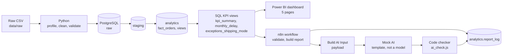

# Architecture

```mermaid
flowchart LR
    A[Raw CSV<br/>data/raw] --> B[Python<br/>profile, clean, validate]
    B --> C[(PostgreSQL<br/>raw)]
    C --> D[(staging)]
    D --> E[(analytics<br/>fact_orders, views)]
    E --> F[SQL KPI views<br/>kpi_summary, monthly_delay,<br/>exceptions_shipping_mode]
    F --> G[Power BI dashboard<br/>5 pages]
    F --> H[n8n workflow<br/>validate, build report]
    H --> I[(analytics.report_log)]
    H --> J[Build AI Input<br/>payload]
    J --> K[Mock AI<br/>template, not a model]
    K --> L[Code checker<br/>ai_check.js]
    L --> I
```

Rejected AI text is never stored, only the rejection reason. The summary step is a template; no AI model has been called.